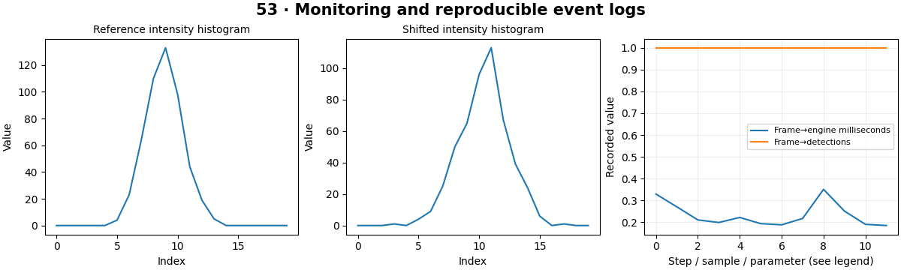

# Production Computer Vision — concepts and mechanisms

## What and why

Production computer vision combines data, models, software and operations. A trained checkpoint is one component of a system that must remain observable and maintainable. Monitoring detects changes, while labeled evaluation determines whether those changes hurt the task.

## 1. Versioned inference and operational metrics

Record model version, preprocessing version, label map and configuration with every deployment. Log bounded metadata and avoid unnecessary image retention. Track errors, request counts and latency distributions. A reproducible artifact allows a previous model to be restored when a release causes a regression.

## 2. Data drift and quality monitoring

Data drift means the input distribution changed; concept drift means the relationship to the target changed. Histogram-based measures such as PSI can flag an intensity shift but cannot prove accuracy loss or identify its cause. Periodically label an appropriate sample and evaluate by meaningful slices.

## 3. Release, rollback and incident response

A release process moves through development, tests, held-out evaluation, optimization, deployment and monitoring. Shadow or canary operation can compare behavior before full rollout when the infrastructure supports it. The capstone provides local inference, tracking, analytics, SQLite, an API and dashboard; authentication and distributed operations remain explicit engineering extensions.

## Mathematical foundation

$$
PSI=\sum_b(p_b-q_b)\log(p_b/q_b)
$$

pb and qb are current and reference proportions in fixed bins. Small smoothing avoids division by zero. PSI is zero for identical distributions; its thresholds are context-dependent and do not measure model accuracy.

The numerical example makes the units and reduction visible before the larger pipeline:

```python
import numpy as np
import cv2

reference = np.array([0.5, 0.5])
current = np.array([0.5, 0.5])
psi = np.sum((current - reference) * np.log(current / reference))
assert np.isclose(psi, 0)
print(psi)
```

## What happens internally

The lab processes a generated video through the engine, persists real numeric events and measures an injected intensity distribution shift. The capstone links these stages to API and dashboard behavior.

Read the chapter entry point, then follow its shared source. The core reference is `engineering.population_stability`. Separate data construction, algorithm, metric and plotting when changing the experiment.

## Visual reasoning



Predict a change before rerunning. Explain what each axis, color, mask or matrix cell represents. In learned examples, compare a loss curve with held-out predictions; in geometry examples, compare coordinate residuals with known synthetic truth. Visual plausibility is useful evidence, but does not replace a declared metric.

## Controlled experiment

Introduce a brightness shift without changing object labels, then a label change without a large brightness shift. Explain which monitoring signal detects each.

Write down the independent variable, what remains fixed, and the metric before changing code. Repeat stochastic experiments with multiple seeds and retain negative results. A timing comparison should include warm-up, repeat count and hardware; never compare unmatched preprocessing or data sizes.

## Applications and limits

Integrate, monitor and evaluate an end-to-end vision service. The mini project applies the mechanism in a small runnable baseline. No drift alert does not imply no accuracy degradation. A dashboard full of metrics is unhelpful without thresholds, ownership and response actions.

The local generated distribution deliberately removes some real-world complexity. External data, pretrained models and hardware paths are documented separately in [external workflows](../../docs/external-workflows.md). A toy objective or synthetic score must be labeled as such when used in a portfolio.

## Exercises and checkpoint

Explain this chapter to someone using one concrete example. Then implement a tiny case, change a parameter, create a failure and apply the method to new data. Use the [three exercise levels](../exercises/beginner.md) and [challenge](../exercises/challenge.md) to record evidence.

## Research connection

[Read the chapter research note](../../docs/research-reading.md#chapter-53). It distinguishes the original contribution, architecture intuition, limitations and alternatives from the scope of the runnable lab.

## References and next step

[Primary reference](https://docs.python.org/3/library/logging.html). Continue through the chapter notebooks and mini project, then follow the next-chapter link in the [chapter README](../README.md).
