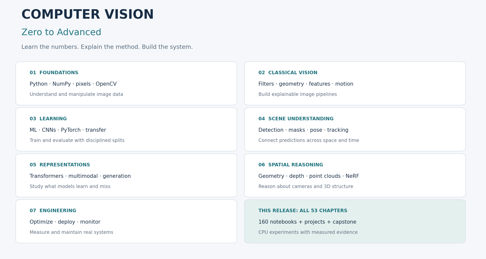

# Computer Vision — Zero to Advanced

**A visual learning journey from pixels to intelligent vision systems.**

Developed by **Shivam Singh · MathTech**.



This release contains **all 53 chapters**, with **160 executable lesson notebooks**, theory, worked mathematics, reusable Python implementations, three exercise levels, open-ended challenges, 53 chapter mini projects and a local real-time capstone. It progresses from Python and pixels to classical CV, learning, detection, segmentation, transformers, generative vision, 3D and deployment.

The default labs use small generated datasets or packaged handwritten digits and run on CPU. Advanced labs teach real algorithms at a manageable scale. Optional workflows connect pretrained models and real datasets; their separate dependencies and validation limits are stated explicitly. This is an educational repository, not a claim of state-of-the-art benchmarks or a fully hardened commercial service.

## Start here

1. Extract this ZIP.
2. Follow the detailed [Windows/Linux/macOS setup guide](docs/setup.md).
3. Read the [roadmap](00-roadmap/README.md) and begin [Chapter 01](01-python-for-computer-vision/README.md).
4. Open the first notebook and run it from top to bottom. Do the exercises before advancing.

For an existing Python 3.12 environment:

```bash
python -m venv .venv
# Windows: use .venv\Scripts\python.exe in place of python below.
# Linux/macOS: source .venv/bin/activate
python -m pip install torch --index-url https://download.pytorch.org/whl/cpu
python -m pip install -e ".[notebooks,deep,api,dev,export]"
python -m jupyter lab
```

On macOS, install PyTorch using `python -m pip install torch` instead of the Linux/Windows CPU-wheel command. The setup guide gives complete environment-specific commands. Core-only study can start with `python -m pip install -e ".[notebooks]"`.

## What this repository teaches

- Arrays, images, gradual mathematical foundations, I/O and visualization.
- Filtering, enhancement, color, geometry, morphology, contours, edges and features.
- Video, calibration, motion, tracking, face-detection mechanics and OCR.
- Dataset design, metrics, explicit backpropagation, CNNs, PyTorch and transfer learning.
- Detection, YOLO workflows, binary/semantic/instance segmentation, pose, hands and actions.
- Attention, ViT, self-supervision, image–text learning, fusion, generation and diffusion.
- Projection, stereo, depth, point clouds, radiance fields, optimization and deployment.
- Reproducibility, failure analysis, latency, monitoring and model-release decisions.

## Who should use it

Beginners with basic Python, engineering students, ML newcomers, working developers, portfolio builders and research-oriented learners. No CV or advanced mathematics is assumed at the beginning. Advanced chapters require the earlier array, geometry and learning foundations.

## Prerequisites

A computer with Python, basic file navigation and willingness to experiment. CPU is enough for the default notebooks. A webcam, GPU, paid service, downloaded model or large dataset is not required. Optional real-data work has its own hardware and data requirements.

## Complete roadmap

Python → NumPy → image fundamentals → OpenCV → image processing → classical CV → machine learning → CNNs → PyTorch → detection → segmentation → tracking → attention/transformers → 3D and multimodal vision → production systems.

Read chapters sequentially. Chapter 37 includes an attention primer before the ViT implementation and points to Chapter 38 for deeper attention experiments; directory numbering follows the requested catalog. [Learning progression and checkpoints](00-roadmap/learning-path.md).

## Chapter map

| # | Chapter | Difficulty | Notebooks |
|---|---|---|---:|
| 01 | [Python for Computer Vision](01-python-for-computer-vision/README.md) | Beginner | 4 |
| 02 | [Mathematics for Computer Vision](02-mathematics-for-computer-vision/README.md) | Beginner | 3 |
| 03 | [Image Fundamentals](03-image-fundamentals/README.md) | Beginner | 3 |
| 04 | [OpenCV Fundamentals](04-opencv-fundamentals/README.md) | Beginner | 3 |
| 05 | [Image Processing](05-image-processing/README.md) | Beginner | 3 |
| 06 | [Image Enhancement](06-image-enhancement/README.md) | Beginner | 3 |
| 07 | [Geometric Transformations](07-geometric-transformations/README.md) | Beginner | 3 |
| 08 | [Color Spaces](08-color-spaces/README.md) | Beginner | 3 |
| 09 | [Feature Detection](09-feature-detection/README.md) | Intermediate | 3 |
| 10 | [Feature Description and Matching](10-feature-description-and-matching/README.md) | Intermediate | 3 |
| 11 | [Morphological Image Processing](11-morphological-image-processing/README.md) | Beginner | 3 |
| 12 | [Contours and Shapes](12-contours-and-shapes/README.md) | Intermediate | 3 |
| 13 | [Edge and Corner Detection](13-edge-and-corner-detection/README.md) | Intermediate | 3 |
| 14 | [Classical Segmentation](14-segmentation-classical/README.md) | Intermediate | 3 |
| 15 | [Video Processing](15-video-processing/README.md) | Intermediate | 3 |
| 16 | [Camera and Calibration](16-camera-and-calibration/README.md) | Intermediate | 3 |
| 17 | [Motion Detection](17-motion-detection/README.md) | Intermediate | 3 |
| 18 | [Object Tracking](18-object-tracking/README.md) | Intermediate | 3 |
| 19 | [Face Detection](19-face-detection/README.md) | Intermediate | 3 |
| 20 | [Face Recognition](20-face-recognition/README.md) | Intermediate | 3 |
| 21 | [OCR](21-ocr/README.md) | Intermediate | 3 |
| 22 | [Machine Learning for Vision](22-machine-learning-for-vision/README.md) | Intermediate | 3 |
| 23 | [CNN Fundamentals](23-cnn-fundamentals/README.md) | Intermediate | 3 |
| 24 | [PyTorch for Computer Vision](24-pytorch-for-computer-vision/README.md) | Intermediate | 3 |
| 25 | [Image Classification](25-image-classification/README.md) | Intermediate | 3 |
| 26 | [Transfer Learning](26-transfer-learning/README.md) | Intermediate | 3 |
| 27 | [Object Detection](27-object-detection/README.md) | Advanced | 3 |
| 28 | [YOLO](28-yolo/README.md) | Advanced | 3 |
| 29 | [Object Segmentation](29-object-segmentation/README.md) | Advanced | 3 |
| 30 | [Instance Segmentation](30-instance-segmentation/README.md) | Advanced | 3 |
| 31 | [Semantic Segmentation](31-semantic-segmentation/README.md) | Advanced | 3 |
| 32 | [Pose Estimation](32-pose-estimation/README.md) | Advanced | 3 |
| 33 | [Hand Tracking](33-hand-tracking/README.md) | Advanced | 3 |
| 34 | [Action Recognition](34-action-recognition/README.md) | Advanced | 3 |
| 35 | [Optical Flow](35-optical-flow/README.md) | Advanced | 3 |
| 36 | [Multi-Object Tracking](36-multi-object-tracking/README.md) | Advanced | 3 |
| 37 | [Vision Transformers](37-vision-transformers/README.md) | Advanced | 3 |
| 38 | [Attention Mechanisms](38-attention-mechanisms/README.md) | Advanced | 3 |
| 39 | [Self-Supervised Learning](39-self-supervised-learning/README.md) | Advanced | 3 |
| 40 | [Vision-Language Models](40-vision-language-models/README.md) | Advanced | 3 |
| 41 | [Multimodal Computer Vision](41-multimodal-computer-vision/README.md) | Advanced | 3 |
| 42 | [Generative Computer Vision](42-generative-computer-vision/README.md) | Advanced | 3 |
| 43 | [Diffusion Models for Vision](43-diffusion-models-for-vision/README.md) | Advanced | 3 |
| 44 | [3D Computer Vision](44-3d-computer-vision/README.md) | Advanced | 3 |
| 45 | [Depth Estimation](45-depth-estimation/README.md) | Advanced | 3 |
| 46 | [Stereo Vision](46-stereo-vision/README.md) | Advanced | 3 |
| 47 | [Point Clouds](47-point-clouds/README.md) | Advanced | 3 |
| 48 | [Neural Radiance Fields](48-neural-radiance-fields/README.md) | Research | 3 |
| 49 | [Model Optimization](49-model-optimization/README.md) | Advanced | 3 |
| 50 | [Computer Vision Deployment](50-computer-vision-deployment/README.md) | Advanced | 3 |
| 51 | [Edge AI](51-edge-ai/README.md) | Advanced | 3 |
| 52 | [Real-Time Computer Vision](52-real-time-computer-vision/README.md) | Advanced | 3 |
| 53 | [Production Computer Vision](53-production-computer-vision/README.md) | Advanced | 3 |

## Learning strategy

**Theory → intuition → visualization → code → experiment → exercise → mini project → real project.**

For each equation, identify symbols and units, work a small numerical example and run its Python equivalent. Change one assumption at a time. Keep an experiment journal, inspect intermediate images and preserve failure examples. At each checkpoint, explain, implement, modify, debug and apply the concept.

## Technology stack

Python, NumPy, Matplotlib, Pillow, OpenCV, SciPy and scikit-learn form the core. PyTorch powers small learned models. Optional torchvision, Ultralytics, Transformers, MediaPipe and Open3D adapters extend the same concepts. FastAPI, SQLite and a browser dashboard form the capstone; ONNX Runtime validates one export path. [Stack and dependency layers](docs/technology-stack.md).

## Projects

[Project catalog](projects/README.md): beginner tools, intermediate systems, advanced applications and research baselines. Each includes configuration, commands, data, training/evaluation guidance, inference, actual baseline visualizations, limits and extension criteria.

[Pixel Lab](projects/beginner/pixel-lab/README.md) is the introductory image editor. The [End-to-End Real-Time Platform](projects/capstone/README.md) includes an API, per-session tracking, color/shape classification, HSV segmentation, SQLite reports and a local image/video/webcam dashboard.

```bash
python -m uvicorn cvzero.platform.app:create_app --factory --host 127.0.0.1 --port 8000
```

Open [localhost:8000](http://127.0.0.1:8000) and start with its synthetic stream. The default pipeline detects colored geometry. A trained detector is an explicit optional adapter, not a hidden pretrained dependency.

## Datasets

Do not commit large datasets or model weights. [Dataset catalog](datasets/README.md) provides official sources, preparation commands, expected structures and license reminders. Default notebooks generate their inputs. The real-data workflows use documented splits and validation-only model selection.

## How to run and verify

```bash
python -m cvzero demo --output artifacts/pixel-first-run
python -m cvzero.course --chapter 13 --lesson 2 --seed 42 --output artifacts/edges-first-run
python scripts/run_project.py --config projects/research/vision-transformer/config.json --output artifacts/vit-project
python -m pytest -q
python scripts/check_repository.py
python scripts/validate_full_course.py --jobs 4
```

Use fresh output folders. The notebooks and CLI fail with useful messages for missing inputs. [Google Colab workflow](docs/colab.md) · [Optional pretrained workflows](docs/external-workflows.md).

## Validation and progress

The release includes actual notebook outputs and machine-readable evidence. [Validation report](docs/VALIDATION.md) · [Chapter progress tracker](docs/PROGRESS.md) · [Reproducibility protocol](docs/reproducibility.md). Numbers shown in executed labs describe those particular data, parameters and hardware. No external-dataset accuracy or real-time FPS is invented.

## How to contribute

Read [CONTRIBUTING](CONTRIBUTING.md), use the [chapter/notebook/project templates](docs/templates/README.md), test meaningful behavior and update validation evidence. Keep explanations gradual and reusable code outside notebooks. [Code of conduct](CODE_OF_CONDUCT.md) · [MIT license](LICENSE). Dataset and model licenses remain separate.
