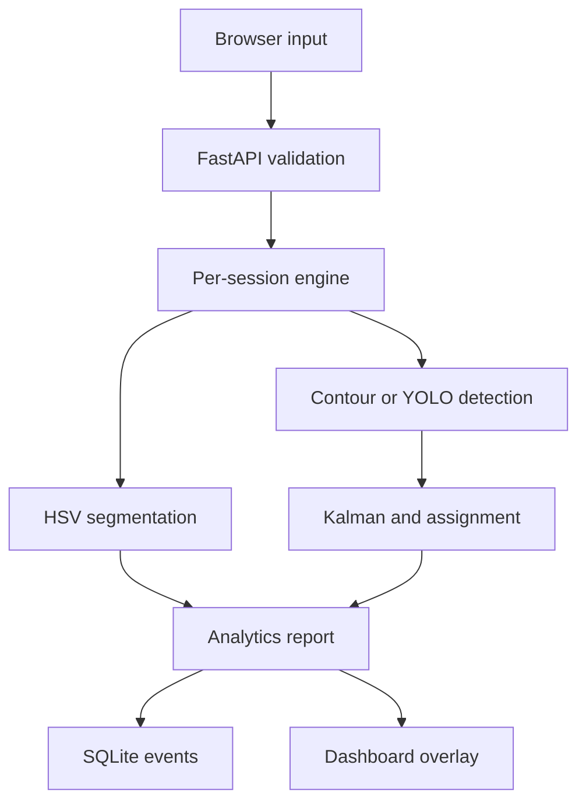
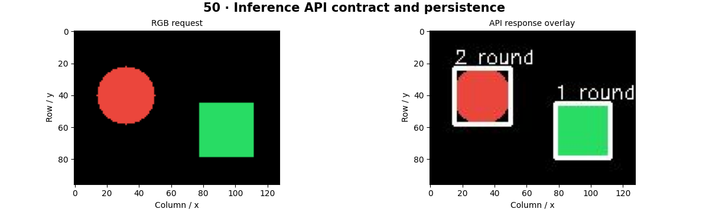

# End-to-End Real-Time Computer Vision Platform

## Problem Statement

Combine input imagery, preprocessing, detection, tracking, classification, segmentation, analytics, storage, an API and a dashboard into a reproducible local system. Understand which stage produced each result and how the system responds to invalid or delayed inputs.

## Objectives

- Run the complete pipeline on CPU with generated video, uploaded images, local video or a webcam.
- Keep temporary track IDs across frames, compute foreground coverage and store numeric event reports.
- Expose testable API contracts and bounded inputs; connect an explicitly supplied trained detector when available.
- Separate synthetic/classical labels from learned object categories and report actual latency.

## Architecture



The default engine detects saturated colored regions, classifies contour geometry as round/angular, performs center-based Kalman/Hungarian tracking and measures an HSV mask. It does not recognize arbitrary real-world categories. Set `CVZERO_MODEL` to a local trained Ultralytics model to replace detection/class labels; segmentation remains explicitly labeled HSV.

## System Flow

Create a session, send increasing frame IDs, decode and validate an image, run the per-session engine, persist the numeric report, encode an overlay and display the response. A browser run has one request in flight. Changing source invalidates callbacks from the previous run. Local video may skip source frames to preserve freshness.

## Dataset

The dashboard's synthetic stream creates a moving circle and a square. No dataset download is needed. Uploaded images and camera frames are processed but not stored by the backend. SQLite stores counts, boxes, temporary IDs and latency; delete the database when you no longer need those reports. For learned object classes, follow the [custom detector workflow](../../docs/external-workflows.md).

## Installation

From the repository root:

```bash
python -m pip install -e ".[api]"
python -m uvicorn cvzero.platform.app:create_app --factory --host 127.0.0.1 --port 8000 --workers 1
```

Open [the local dashboard](http://127.0.0.1:8000). Select **Run synthetic stream** first. Webcam access needs a browser permission and a supported secure context such as localhost. **Stop** releases camera tracks.

## Folder Structure

| Path | Responsibility |
|---|---|
| `src/cvzero/platform/app.py` | API factory, validation, session locking and ordering |
| `src/cvzero/platform/engine.py` | Segmentation, detection, classification, tracking and overlay |
| `src/cvzero/platform/store.py` | SQLite events; parameterized SQL |
| `src/cvzero/platform/static/index.html` | Local dashboard and image/video/webcam input |
| `tests/test_platform.py` | Input limits, persistence, state isolation and errors |
| `Dockerfile`, `compose.yml` | Local container deployment |

## Configuration

`CVZERO_DB` selects the database file; default is `artifacts/platform/events.sqlite3`. `CVZERO_MODEL` optionally selects an existing trained YOLO file; a missing file fails with a clear error. Install `ultralytics` separately for this path and review its license. Models are not downloaded automatically by the platform. Inference is CPU by default.

Sessions expire opportunistically after 30 minutes of inactivity when new sessions are created. At most 64 sessions are active. The teaching tracker models time in processed-frame steps; extending it to physical velocity requires timestamp propagation. Use one server worker because session state is in memory.

## Training

The default classical pipeline has no learned weights. Train a detector using the complete Chapter 28 workflow, freeze preprocessing and class names, then set `CVZERO_MODEL` to its weight file. The local tiny CNN and U-Net are separate teaching models; they are not silently substituted into this API.

## Evaluation

```bash
python -m pytest tests/test_platform.py -q
python -m cvzero.course --chapter 50 --output artifacts/api-check
python -m cvzero.course --chapter 53 --output artifacts/production-check
```

The route tests use an in-process HTTP client. This validates request handling and SQLite behavior, not network throughput, browser compatibility or public deployment security. Annotate real frames to evaluate the detector; measure identity switches separately from detection quality.

## Inference

Endpoints: `GET /health`, `POST /sessions`, `POST /sessions/{id}/frames`, `GET /sessions/{id}/history?limit=100`. The frame body contains `frame_id` and `image_base64` without a data-URL prefix. Images must be PNG/JPEG/WebP, at most 2 MB encoded bytes and 2 megapixels. Repeated or stale IDs return HTTP 409. Invalid images return 400; schema violations return 422.

## Results

The chapter reports include measured engine latency and persistence checks. The default score is `null` because a color/shape rule does not produce a calibrated confidence. The dashboard separately displays round-trip and engine latency. No 30-FPS claim is made.

## Screenshots



The screenshot is the actual API lab output. The dashboard is shipped as a local web interface; it is not a remotely hosted site.

## Logging and Metrics

The `cvzero.platform` logger records session ID, frame ID, count and processing latency. Uvicorn provides request logs. SQLite history stores numeric reports for replay or export through the API. The monitoring lab also demonstrates PSI drift on a generated intensity distribution; drift is not labeled accuracy.

## Deployment

```bash
docker compose up --build
```

The compose file publishes only on `127.0.0.1:8000`. The image runs as a non-root user with a persistent database volume. Container commands are provided for local execution; container build and live webcam behavior are listed separately from tested CPU notebooks in the validation report.

## Limitations

This is a functional teaching platform, not a fully hardened multi-tenant service. It has no authentication or TLS termination, distributed session store, database migration framework, GPU scheduling, calibrated classifier, learned mask adapter or clinical interpretation. The default color detector will miss low-saturation objects and respond to colorful background regions. Crossings and occlusion can change temporary track IDs. SQLite history does not persist tracker state after restart.

## Future Improvements

Add timestamp-aware motion, a trained segmentation adapter, model version fields, authenticated ingress, persistent worker ownership, bounded external request sizes at the proxy, retention jobs and target-hardware load tests. Use validation gates and a versioned rollback artifact for each release.

## References

[FastAPI](https://fastapi.tiangolo.com/) · [OpenCV](https://docs.opencv.org/4.x/) · [Ultralytics](https://docs.ultralytics.com/) · [SQLite](https://www.sqlite.org/docs.html)

## Example commands

```bash
python -m uvicorn cvzero.platform.app:create_app --factory --host 127.0.0.1 --port 8000
```

On PowerShell, set the database with `$env:CVZERO_DB = "artifacts/platform/events.sqlite3"`. On POSIX shells, use `export CVZERO_DB=artifacts/platform/events.sqlite3`.

## Expected output

Uvicorn prints its local listening URL. The dashboard produces annotated images, counts, temporary track IDs, foreground coverage and current timing measurements. SQLite grows by one event for each successful frame. Exact performance depends on data and hardware.
